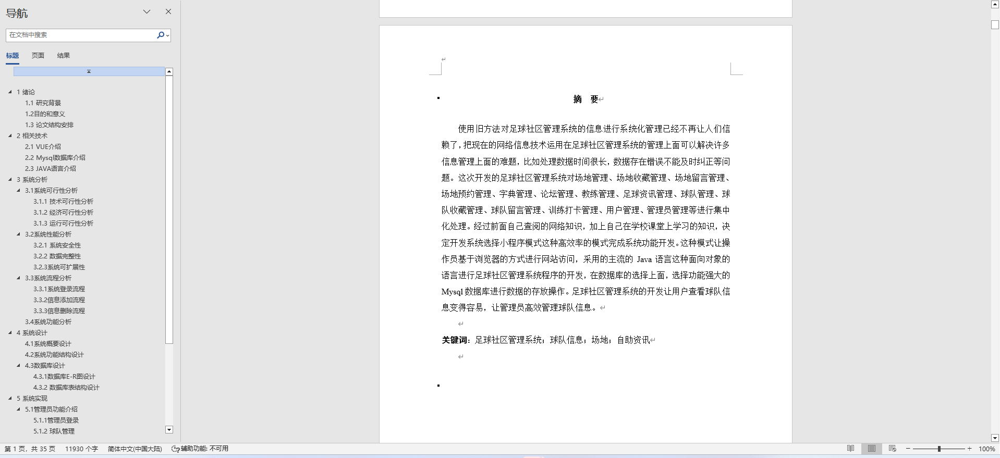
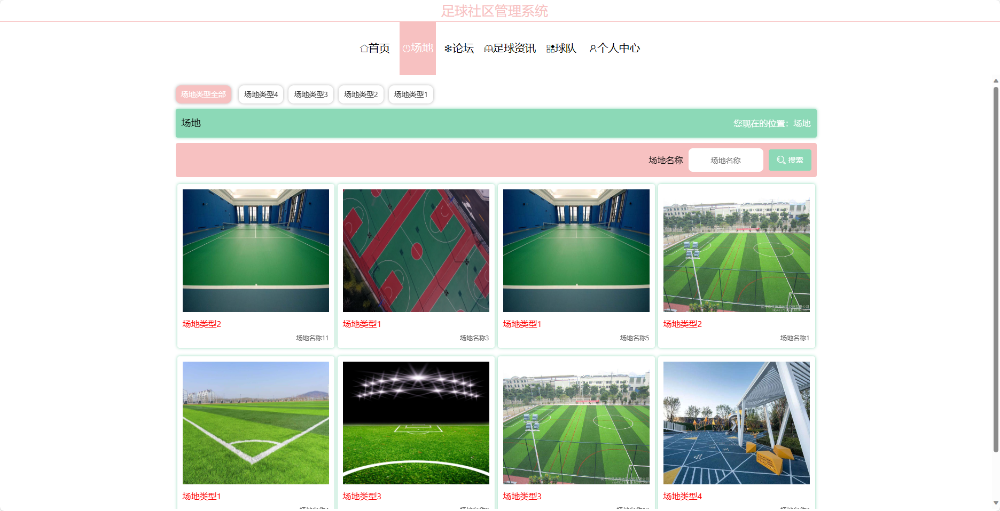
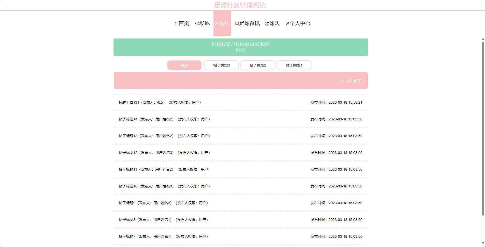
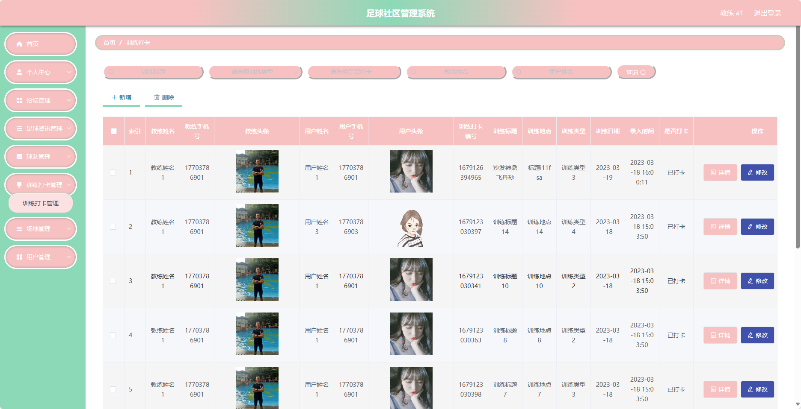

## 基于SpringBoot的足球社区管理系统(程序+报告)

###  获取sql数据库文件: 从戎源码网 (https://armycodes.com/) QQ: 386869957 QQ群: 377586148
###  所有系统地址: (https://github.com/YuLin-Coder/AllProjectCatalog) 
###  所有项目以及源代码本人均调试运行无问题 可支持远程安装部署调试、定制修改、代码讲解

## 项目介绍
基于SpringBoot的足球社区管理系统，系统包含两种角色：管理员、教练用户,系统分为前台和后台两大模块，主要功能如下。

### 【管理员】：
- 个人中心：管理员可以查看和编辑个人信息。
- 管理员管理：管理员可以对其他管理员进行管理，包括添加、编辑和删除管理员账号。
- 基础数据管理：管理员可以管理系统的基础数据，包括分类、标签等信息的添加、编辑和删除。
- 论坛管理：管理员可以管理论坛的帖子，包括审核、删除等操作。
- 足球资讯管理：管理员可以发布和管理系统的足球资讯信息，包括添加、编辑和删除资讯。
- 球队管理：管理员可以管理球队的信息，包括添加、编辑和删除球队，以及管理球队成员。
- 训练打卡管理：管理员可以管理学生的训练打卡记录，包括查看、审核和统计等操作。
- 场地管理：管理员可以管理场地的信息，包括添加、编辑和删除场地，以及场地的预订和租借管理。
- 用户管理：管理员可以管理用户账号，包括查看用户信息、禁用用户账号等操作。
- 轮播图信息：管理员可以管理首页的轮播图信息，包括添加、编辑和删除轮播图。

### 【前台】：
- 首页：展示系统的概览信息和热门内容。
- 足球资讯：提供最新的足球资讯新闻、赛事报道等内容。
- 球队：展示各个球队的信息和成员，包括球队介绍、球员信息等。
- 场地：提供足球场地的信息，包括场地预订、场地租借等功能。
- 论坛：提供一个讨论足球相关话题的平台。

### 【教练】：
- 个人中心：教练可以查看和编辑个人信息。
- 论坛管理：教练可以管理论坛的帖子，包括发帖、回复和删除等操作。
- 足球资讯管理：教练可以发布和管理系统的足球资讯信息，包括添加、编辑和删除资讯。
- 球队管理：教练可以管理球队的信息，包括添加、编辑和删除球队，以及管理球队成员。
- 训练打卡管理：教练可以管理学生的训练打卡记录，包括查看、审核和统计等操作。
- 场地管理：教练可以管理场地的信息，包括添加、编辑和删除场地，以及场地的预订和租借管理。
- 用户管理：教练可以查看学生的信息，包括学生的个人信息和训练打卡记录。

## 项目技术
- 编程语言：Java
- 数据库：MySQL
- 项目管理工具：Maven
- 前端技术：VUE、HTML、Jquery、Bootstrap
- 后端技术：Spring、SpringMVC、MyBatis

## 运行环境
- JDK版本：JDK1.8及以上
- 开发工具：IDEA、Ecplise、Myecplise都可以
- 数据库: MySQL5.7及以上
- Maven：maven3.0及以上
- Node：14.14.0及以上

## 运行截图

